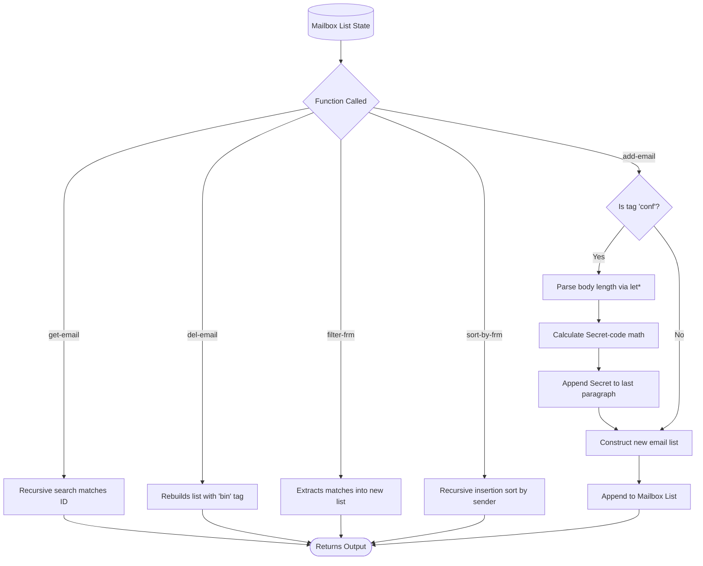

# functional_email_client
A purely functional implementation of an email client simulator written in Scheme, demonstrating recursive data structures, list processing, and custom sorting algorithms.

# Scheme Outlook Simulator (Functional Paradigm)

This project is a functional programming implementation of an Outlook Mailbox Simulator written in Scheme. Moving away from Object-Oriented state management, this version models a mailbox as an immutable, nested list structure. It utilizes purely functional concepts—such as recursion, list processing (`car`/`cdr`), and local variable bindings (`let*`)—to evaluate and return new mailbox states for every user action[cite: 10, 14, 15].

## Core Features

*   **Recursive List Processing:** Retrieves specific emails by ID through recursive traversal and simulates deletion by generating a new list state where the target email's tag is updated to `bin`[cite: 10, 11].
*   **Custom Functional Sorting:** Organizes the mailbox alphabetically by sender using a custom recursive insertion sort algorithm (`sort-by-frm`)[cite: 13].
*   **Data Filtering:** Iterates through nested list architectures to filter and return sub-lists of emails matching specific sender addresses[cite: 12].
*   **Dynamic Secret Generation:** Automatically detects emails tagged as `conf`, dynamically counts paragraphs and sentences recursively, and calculates a two-part mathematical `Secret-code` that is appended to the message body[cite: 14, 15].
*   **State-Free Appends:** Computes the highest current email ID by recursively parsing the mailbox, then generates and appends a newly constructed email list to the mailbox structure[cite: 14, 15].

## Functional Execution Flow



## Tech Stack

*   **Language:** Scheme / Racket
*   **Core Concepts:** Functional Programming, Recursion, Immutable Data Structures, List Processing, Insertion Sort.

## Usage

This program is designed to be run in a Scheme environment such as DrRacket. 

1. Load the `outlook_simulator.scm` file into your REPL environment.
2. The environment initializes with a pre-populated test mailbox bound to the variable `mb`[cite: 16].
3. Execute functions by passing the target parameters and the mailbox list. 

**Example Commands:**
```scheme
; Retrieve an email
(get-email 1 mb)

; Move an email to the bin (returns new mailbox state)
(del-email 1 mb)

; Sort the mailbox alphabetically by sender
(sort-by-frm mb)

; Add a new confidential email with automatic encryption
(add-email 'Kim9@gre.ac.uk 'Zia10@gre.ac.uk '(10 2 2026) "Reminder!" 'conf '(("Body msg new.")("Sam." "Zia.")) mb)
```
## License
This project is licensed under the MIT License.
